# MEDAXIS Doctor Portal — Complete Process Flow Guide

**Version:** 2026-08-07  
**Audience:** Telehealth staff · Product managers · Engineers · New developers · Clinical QA

---

## How to Read This Document

This guide documents every workflow in the MEDAXIS telehealth portal — from the moment a patient submits an intake form to the moment a prescription reaches a pharmacy. It is written for three audiences simultaneously:

- **Telehealth professionals** will find clinical workflow logic, triage definitions, state licensing rules, and prescribing safeguards explained in plain language.
- **Engineers** will find controller references, state machine transitions, job names, and data written at each step.
- **Designers and product managers** will find UX decision points, error paths, and user-facing consequences of every system action.

Diagrams use [Mermaid](https://mermaid.js.org/) syntax — rendered natively on GitHub and most modern documentation platforms.

---

## Contents

1. [System Overview](#1-system-overview)
2. [Actors & Roles](#2-actors--roles)
3. [Patient Intake — Two Entry Paths](#3-patient-intake--two-entry-paths)
4. [Case Lifecycle — The Status Machine](#4-case-lifecycle--the-status-machine)
5. [Triage Classification](#5-triage-classification)
6. [Clinician Routing — How Cases Get Assigned](#6-clinician-routing--how-cases-get-assigned)
7. [Provider Pool (Pull Model)](#7-provider-pool-pull-model)
8. [The Complete Prescribing Flow](#8-the-complete-prescribing-flow)
9. [Pharmacy Dispatch & Retry](#9-pharmacy-dispatch--retry)
10. [Support & Escalation Flows](#10-support--escalation-flows)
11. [Questionnaire / Intake Form Flow](#11-questionnaire--intake-form-flow)
12. [Webhook System](#12-webhook-system)
13. [SLA & Deadline Management](#13-sla--deadline-management)
14. [AI Assist — Clinical Drafts](#14-ai-assist--clinical-drafts)
15. [EHR Integration](#15-ehr-integration)
16. [Audit Trail](#16-audit-trail)
17. [Edge Cases & Safety Rules](#17-edge-cases--safety-rules)
18. [Security & Compliance Guardrails](#18-security--compliance-guardrails)

---

## 1. System Overview

MEDAXIS is an **asynchronous telehealth portal**. A patient submits a health intake form, a licensed clinician reviews it and prescribes medication, and the prescription is dispatched electronically to a compounding pharmacy — all without a synchronous appointment (unless the patient's state requires one).

The platform is **multi-tenant**: each **Partner** (a brand, clinic, or employer) has its own patient population, product catalog, and branding. Partners integrate via REST API or can use a hosted intake form.

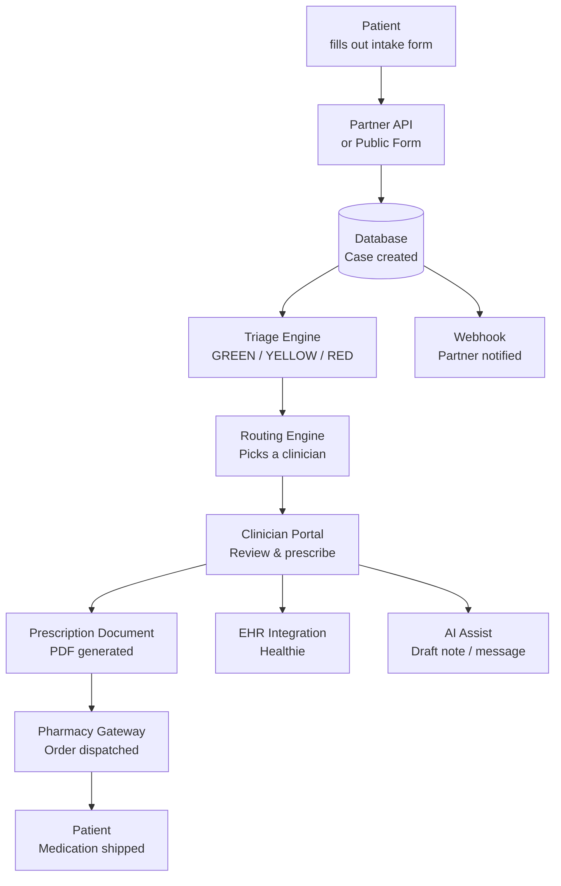
```mermaid
graph TD
    P[Patient<br/>fills out intake form] --> PI[Partner API<br/>or Public Form]
    PI --> DB[(Database<br/>Case created)]
    DB --> T[Triage Engine<br/>GREEN / YELLOW / RED]
    T --> R[Routing Engine<br/>Picks a clinician]
    R --> C[Clinician Portal<br/>Review & prescribe]
    C --> RX[Prescription Document<br/>PDF generated]
    RX --> PH[Pharmacy Gateway<br/>Order dispatched]
    PH --> PAT[Patient<br/>Medication shipped]

    DB --> W[Webhook<br/>Partner notified]
    C --> EHR[EHR Integration<br/>Healthie]
    C --> AI[AI Assist<br/>Draft note / message]
```

**Plain English:** Think of MEDAXIS as a digital doctor's office. The patient fills in a questionnaire online (the "intake"), the system automatically checks for red flags (triage), routes the case to the most appropriate available doctor (routing), the doctor reviews and signs off digitally (prescribing), and the signed prescription goes directly to the pharmacy electronically.

---

## 2. Actors & Roles

| Role | Portal | What they do |
|------|--------|-------------|
| **Partner** (system admin for their brand) | `/partner/` | Manages their catalog of products (offerings), patients, and cases. Watches case status. Can cancel, put on hold, or return cases to clinicians. |
| **Super Admin** | `/admin/` | Full system access. Creates partners, offerings, questionnaires, clinicians, routing policy, AI instruction sets, settings. Sees all data across all tenants. |
| **Admin** (Doctor Admin) | `/admin/` | Manages their assigned pool of clinicians. Sees cases assigned to their clinicians or unassigned cases. Cannot see other teams' cases. |
| **Clinician** | `/clinician/` | Reviews cases, writes prescriptions, sends messages, adds clinical notes, escalates if needed. |
| **Support Staff** | `/support/` | Limited view — handles escalated cases only. |
| **Patient** | No login in portal | Submits intake form, receives messages/approvals via email/SMS. |
| **Partner API** | REST API | Programmatic integration — creates patients, submits cases, queries status, sends messages. |

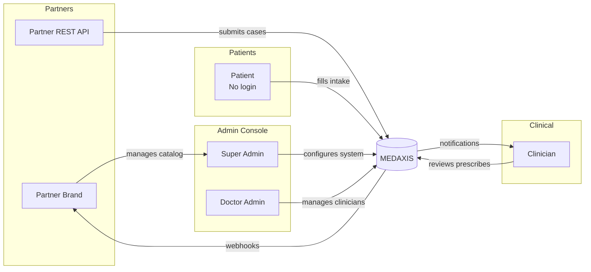
```mermaid
graph LR
    subgraph Partners
        PR[Partner Brand]
        PAPI[Partner REST API]
    end
    subgraph Admin Console
        SA[Super Admin]
        DA[Doctor Admin]
    end
    subgraph Clinical
        CL[Clinician]
    end
    subgraph Patients
        PAT[Patient<br/>No login]
    end
    
    PR -- manages catalog --> SA
    PAPI -- submits cases --> DB[(MEDAXIS)]
    PAT -- fills intake --> DB
    SA -- configures system --> DB
    DA -- manages clinicians --> DB
    CL -- reviews prescribes --> DB
    DB -- notifications --> CL
    DB -- webhooks --> PR
```

---

## 3. Patient Intake — Two Entry Paths

There are two ways a patient's case enters MEDAXIS:

### Path A — Partner REST API

The partner's system calls the API after the patient completes their own checkout or intake form.

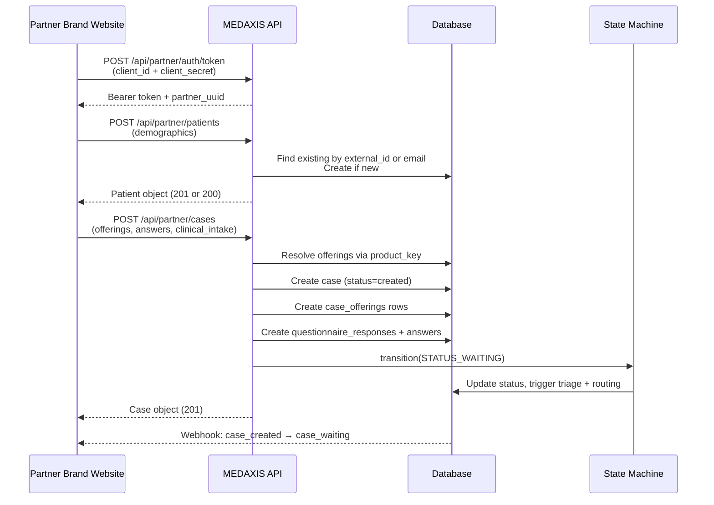
```mermaid
sequenceDiagram
    participant Brand as Partner Brand Website
    participant API as MEDAXIS API
    participant DB as Database
    participant SM as State Machine

    Brand->>API: POST /api/partner/auth/token<br/>(client_id + client_secret)
    API-->>Brand: Bearer token + partner_uuid

    Brand->>API: POST /api/partner/patients<br/>(demographics)
    API->>DB: Find existing by external_id or email<br/>Create if new
    API-->>Brand: Patient object (201 or 200)

    Brand->>API: POST /api/partner/cases<br/>(offerings, answers, clinical_intake)
    API->>DB: Resolve offerings via product_key
    API->>DB: Create case (status=created)
    API->>DB: Create case_offerings rows
    API->>DB: Create questionnaire_responses + answers
    API->>SM: transition(STATUS_WAITING)
    SM->>DB: Update status, trigger triage + routing
    API-->>Brand: Case object (201)
    DB-->>Brand: Webhook: case_created → case_waiting
```

**Key detail:** The partner passes `product_key + month_frequency` (from their product catalog) OR a direct `offering_id`. The system resolves which MEDAXIS offering is linked to that product key via the `partner_product_plans` table.

**Hold mode:** If the partner passes `hold_status: true`, the case stays in `STATUS_CREATED` and does NOT enter the clinician queue until the partner explicitly releases it (`POST /cases/{id}/hold` with `hold: false`). This is used when a partner needs to complete payment verification or ID checks before clinical review begins.

---

### Path B — Hosted Public Intake Form

A patient fills out a form at a URL like `https://portal.medaxis.com/forms/{questionnaire-uuid}`. No login required.

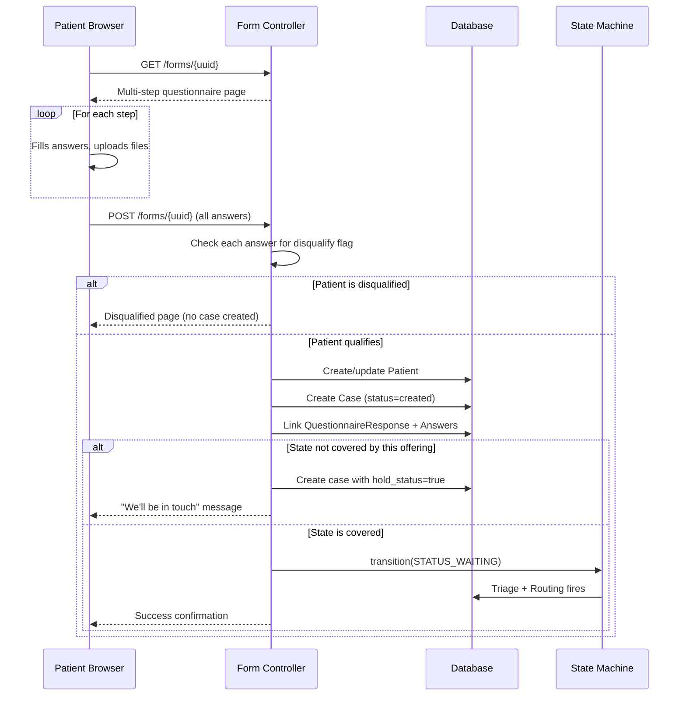
```mermaid
sequenceDiagram
    participant PAT as Patient Browser
    participant FORM as Form Controller
    participant DB as Database
    participant SM as State Machine

    PAT->>FORM: GET /forms/{uuid}
    FORM-->>PAT: Multi-step questionnaire page

    loop For each step
        PAT->>PAT: Fills answers, uploads files
    end

    PAT->>FORM: POST /forms/{uuid} (all answers)
    FORM->>FORM: Check each answer for disqualify flag

    alt Patient is disqualified
        FORM-->>PAT: Disqualified page (no case created)
    else Patient qualifies
        FORM->>DB: Create/update Patient
        FORM->>DB: Create Case (status=created)
        FORM->>DB: Link QuestionnaireResponse + Answers
        
        alt State not covered by this offering
            FORM->>DB: Create case with hold_status=true
            FORM-->>PAT: "We'll be in touch" message
        else State is covered
            FORM->>SM: transition(STATUS_WAITING)
            SM->>DB: Triage + Routing fires
            FORM-->>PAT: Success confirmation
        end
    end
```

**Disqualification:** Some questionnaire questions have options flagged `is_disqualify: true`. If a patient picks a disqualifying answer (e.g., a contraindicated condition), the case is NEVER created and the patient sees a polite "not eligible" message. The questionnaire response is stored for audit purposes, but no clinical record is created.

**State hold:** If the requested offering is not available in the patient's state (`available_states` on the offering does not include their state), the case is created with `hold_status=true` and a `support_note` explaining the hold. It does NOT enter the clinician queue. Someone must manually review and resolve.

---

### Case creation — what gets written

When a case is created (either path), the following database records are written inside a single transaction:

| Table | What's stored |
|-------|---------------|
| `cases` | UUID, partner_id, patient_id, status=created, hold_status, is_refill, patient_state, visit_type, clinical_intake JSON |
| `case_offerings` | One row per ordered medication: offering_id, quantity, price, month_frequency, product_key (snapshotted) |
| `questionnaire_responses` | One per questionnaire: is_disqualified flag, completed_at |
| `questionnaire_answers` | One per answer: question_text frozen at submission time (so question edits don't change history) |
| `patient_files` | Files uploaded during intake (lab results, ID documents, etc.) |

**The product_key and month_frequency on case_offerings are snapshotted at creation time.** If the partner later changes their product plan, existing cases are unaffected.

---

## 4. Case Lifecycle — The Status Machine

Every case moves through a defined set of statuses. Only legal transitions are allowed — the system throws an error if anything tries to skip or go backwards.

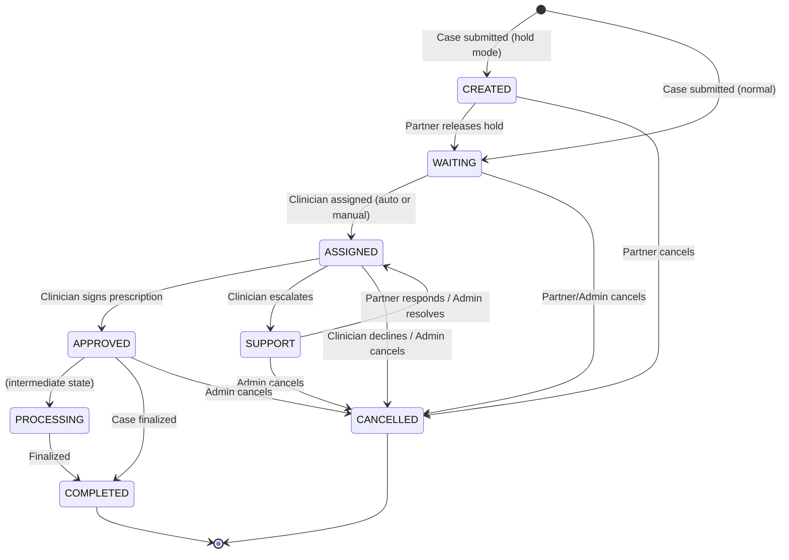
```mermaid
stateDiagram-v2
    [*] --> CREATED : Case submitted (hold mode)
    [*] --> WAITING : Case submitted (normal)
    CREATED --> WAITING : Partner releases hold
    CREATED --> CANCELLED : Partner cancels
    WAITING --> ASSIGNED : Clinician assigned (auto or manual)
    WAITING --> CANCELLED : Partner/Admin cancels
    SUPPORT --> ASSIGNED : Partner responds / Admin resolves
    SUPPORT --> CANCELLED : Admin cancels
    ASSIGNED --> APPROVED : Clinician signs prescription
    ASSIGNED --> SUPPORT : Clinician escalates
    ASSIGNED --> CANCELLED : Clinician declines / Admin cancels
    APPROVED --> PROCESSING : (intermediate state)
    APPROVED --> COMPLETED : Case finalized
    APPROVED --> CANCELLED : Admin cancels
    PROCESSING --> COMPLETED : Finalized
    COMPLETED --> [*]
    CANCELLED --> [*]
```

### What happens at each status change

| Transition | What fires |
|-----------|------------|
| `→ WAITING` | **Triage runs.** Auto-assigner checks routing policy. `NewCaseSubmitted` notification sent to all admins. Webhook: `case_waiting`. |
| `→ ASSIGNED` | `assigned_at` stamped. Webhook: `case_assigned_to_clinician`. `ClinicianCaseAssigned` notification to clinician. `SendIntakeConfirmationJob` dispatched (10 second delay). |
| `→ APPROVED` | `approved_at` stamped. Webhook: `case_approved`. Prescription document generated, pharmacy dispatch queued. |
| `→ COMPLETED` | `completed_at` stamped. Webhook: `case_completed`. `CaseCompleted` notification to admins. `PartnerCaseCompleted` notification to partner users. |
| `→ CANCELLED` | `cancelled_at` + `cancellation_reason` stored. Webhook: `case_cancelled`. `PartnerCaseCancelled` to partner users. |
| `→ SUPPORT` | `support_at` stamped (only first time). `escalation_target` set (support/doctor_admin). Webhook: `case_support`. `PartnerCaseSupport` to partner users. |

### "Open" vs "Closed" — what the dashboard counts

The dashboard's **"open cases"** count only includes: `waiting`, `assigned`, `support`.

It does NOT count `created` (on hold), `approved`, `processing`, `completed`, or `cancelled`.

This matches clinical reality: a case that's been approved but not yet confirmed-complete is in a brief intermediate window, not an open clinical obligation.

---

## 5. Triage Classification

Triage is a **risk stratification** system. When a case enters `WAITING`, the system automatically evaluates it and assigns one of three colors.

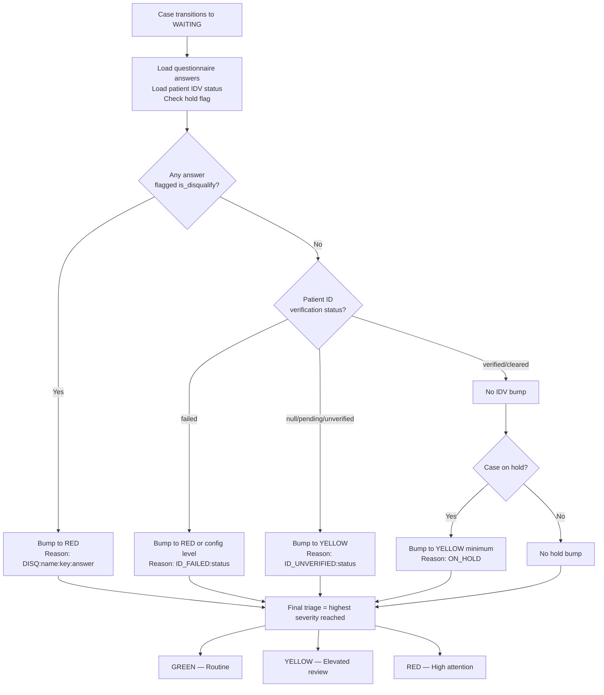
```mermaid
flowchart TD
    A[Case transitions to WAITING] --> B[Load questionnaire answers<br/>Load patient IDV status<br/>Check hold flag]

    B --> C{Any answer<br/>flagged is_disqualify?}
    C -- Yes --> RED1[Bump to RED<br/>Reason: DISQ:name:key:answer]
    C -- No --> D{Patient ID<br/>verification status?}

    D -- verified/cleared --> E[No IDV bump]
    D -- failed --> RED2[Bump to RED or config level<br/>Reason: ID_FAILED:status]
    D -- null/pending/unverified --> YEL1[Bump to YELLOW<br/>Reason: ID_UNVERIFIED:status]

    E --> F{Case on hold?}
    F -- Yes --> YEL2[Bump to YELLOW minimum<br/>Reason: ON_HOLD]
    F -- No --> G[No hold bump]

    RED1 --> FINAL
    RED2 --> FINAL
    YEL1 --> FINAL
    YEL2 --> FINAL
    G --> FINAL

    FINAL[Final triage = highest severity reached]
    FINAL --> GRN[GREEN — Routine]
    FINAL --> YLW[YELLOW — Elevated review]
    FINAL --> RD[RED — High attention]
```

**Plain English:**
- **GREEN:** The patient passed all screening questions and their ID was verified. This case can be reviewed and approved at normal pace.
- **YELLOW:** Something needs closer attention — the patient's ID isn't verified, or there's a hold flag. Not necessarily dangerous, but don't fast-track.
- **RED:** A disqualifying condition was flagged in the questionnaire, OR the patient's ID verification failed. This case must be reviewed carefully by the clinician before any prescription.

### What triage affects

| Feature | GREEN | YELLOW | RED |
|---------|-------|--------|-----|
| Queue sort order | Last | Middle | First |
| Batch (bulk) approval | Allowed | Not allowed | Not allowed |
| Dashboard "triage volume" | Counted | Counted | Counted |
| Exception center | Not flagged | Not flagged | Flagged as high-attention |

**Triage can change after assignment.** If a partner updates a patient's `id_verified_status`, the triage classifier re-runs on all open (waiting/assigned) cases for that patient automatically.

---

## 6. Clinician Routing — How Cases Get Assigned

When a case enters `WAITING`, the routing engine fires to find the best available clinician.

### Overall routing decision flow

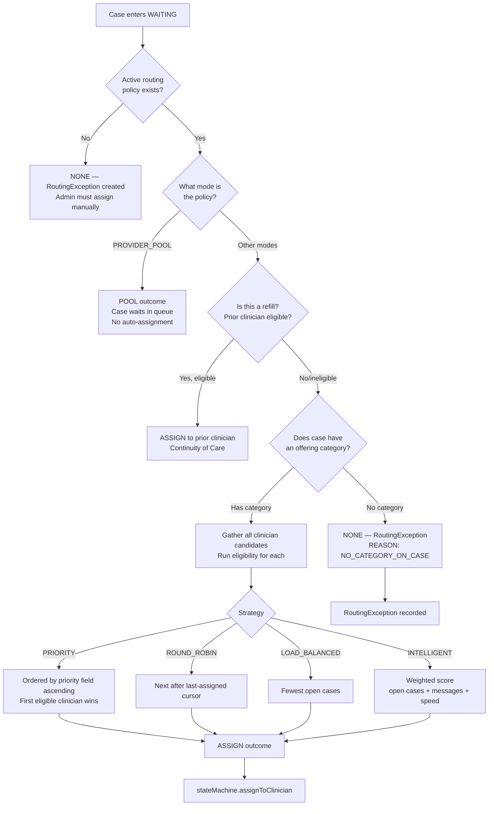
```mermaid
flowchart TD
    W[Case enters WAITING] --> AP{Active routing<br/>policy exists?}
    AP -- No --> NONE1[NONE — RoutingException created<br/>Admin must assign manually]
    AP -- Yes --> MODE{What mode is<br/>the policy?}

    MODE -- PROVIDER_POOL --> POOL[POOL outcome<br/>Case waits in queue<br/>No auto-assignment]
    MODE -- Other modes --> COC{Is this a refill?<br/>Prior clinician eligible?}

    COC -- Yes, eligible --> ASSIGN_COC[ASSIGN to prior clinician<br/>Continuity of Care]
    COC -- No/ineligible --> CAT{Does case have<br/>an offering category?}

    CAT -- No category --> NONE2[NONE — RoutingException<br/>REASON: NO_CATEGORY_ON_CASE]
    CAT -- Has category --> CANDS[Gather all clinician candidates<br/>Run eligibility for each]

    CANDS --> SEL{Strategy}
    SEL -- PRIORITY --> P[Ordered by priority field ascending<br/>First eligible clinician wins]
    SEL -- ROUND_ROBIN --> RR[Next after last-assigned cursor]
    SEL -- LOAD_BALANCED --> LB[Fewest open cases]
    SEL -- INTELLIGENT --> INT[Weighted score<br/>open cases + messages + speed]

    P --> ASSIGN[ASSIGN outcome]
    RR --> ASSIGN
    LB --> ASSIGN
    INT --> ASSIGN
    ASSIGN --> SM[stateMachine.assignToClinician]
    NONE2 --> EX[RoutingException recorded]
```

### Clinician eligibility — what blocks assignment

The system checks every candidate clinician against up to 12 rules. All failures are collected (not just the first one), so the admin can see exactly why a clinician was skipped.

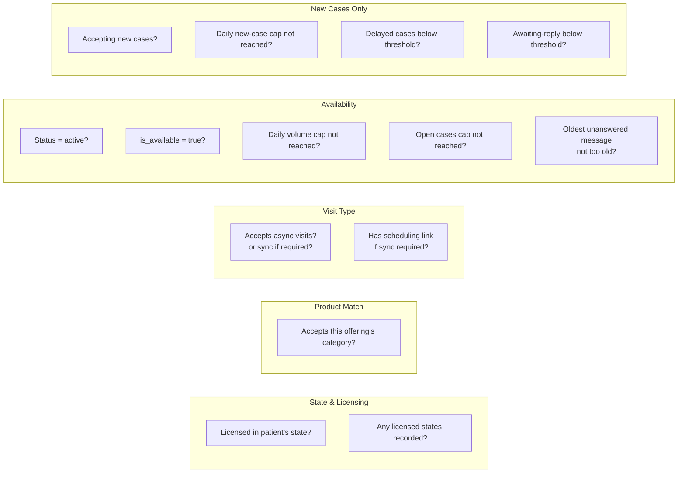
```mermaid
flowchart LR
    subgraph State & Licensing
        L1[Licensed in patient's state?]
        L2[Any licensed states recorded?]
    end
    subgraph Product Match
        P1[Accepts this offering's category?]
    end
    subgraph Visit Type
        V1[Accepts async visits?<br/>or sync if required?]
        V2[Has scheduling link<br/>if sync required?]
    end
    subgraph Availability
        A1[Status = active?]
        A2[is_available = true?]
        A3[Daily volume cap not reached?]
        A4[Open cases cap not reached?]
        A5[Oldest unanswered message<br/>not too old?]
    end
    subgraph New Cases Only
        N1[Accepting new cases?]
        N2[Daily new-case cap not reached?]
        N3[Delayed cases below threshold?]
        N4[Awaiting-reply below threshold?]
    end
```

All of the above must pass for a clinician to be eligible. A null cap (`max_daily_cases = null`) means uncapped. A non-integer cap value (data error) is treated as a hard block — the system fails closed.

**Blank `licensed_states`** is also a block. A clinician with no licensed states recorded is treated as licensed nowhere, not everywhere. This prevents accidental cross-state prescribing.

### Routing exception

If no eligible clinician exists after checking all candidates, a `RoutingException` is created. An admin sees it in the "Exception Center" on the dashboard and must manually assign the case.

The `routing:sweep-exceptions` command runs every 15 minutes:
- If a case was self-resolved (it now has a clinician and isn't waiting), the exception is auto-closed.
- If the exception is old enough and hasn't been notified yet, all admins get a `RoutingExceptionRaised` notification.

---

## 7. Provider Pool (Pull Model)

When routing policy mode is `PROVIDER_POOL`, cases do NOT get auto-assigned. Instead, clinicians actively **pull** cases from the queue by requesting a batch.

This is a fundamentally different model: instead of the system pushing work to doctors, doctors reach into a shared queue and claim what they can handle.

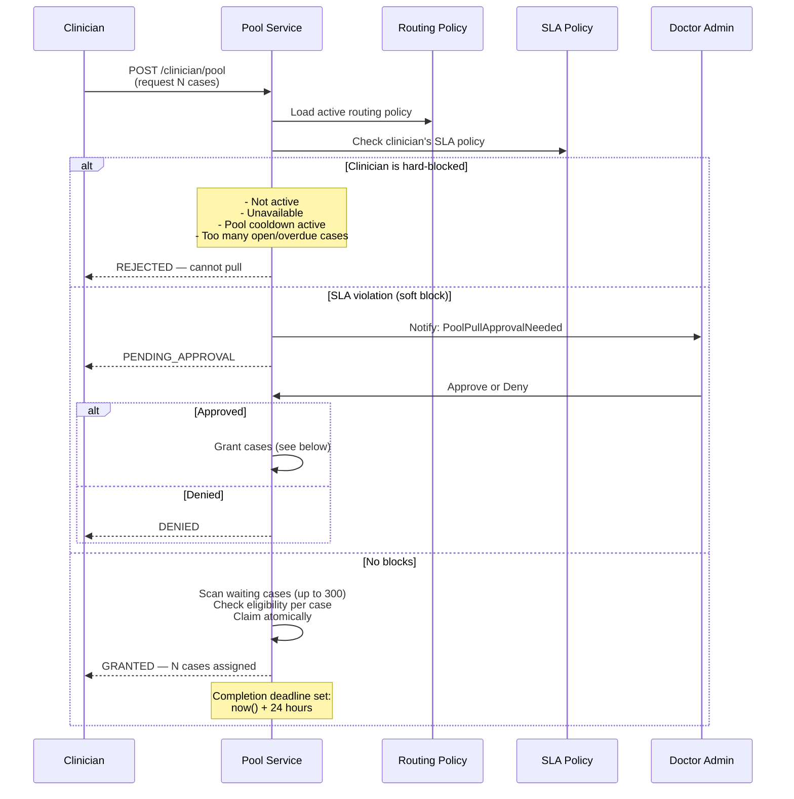
```mermaid
sequenceDiagram
    participant CL as Clinician
    participant POOL as Pool Service
    participant POL as Routing Policy
    participant SLA as SLA Policy
    participant ADMIN as Doctor Admin

    CL->>POOL: POST /clinician/pool<br/>(request N cases)
    POOL->>POL: Load active routing policy
    POOL->>SLA: Check clinician's SLA policy

    alt Clinician is hard-blocked
        Note over POOL: - Not active<br/>- Unavailable<br/>- Pool cooldown active<br/>- Too many open/overdue cases
        POOL-->>CL: REJECTED — cannot pull
    else SLA violation (soft block)
        POOL->>ADMIN: Notify: PoolPullApprovalNeeded
        POOL-->>CL: PENDING_APPROVAL
        ADMIN->>POOL: Approve or Deny
        alt Approved
            POOL->>POOL: Grant cases (see below)
        else Denied
            POOL-->>CL: DENIED
        end
    else No blocks
        POOL->>POOL: Scan waiting cases (up to 300)<br/>Check eligibility per case<br/>Claim atomically
        POOL-->>CL: GRANTED — N cases assigned
        Note over POOL: Completion deadline set:<br/>now() + 24 hours
    end
```

**"Claim atomically"** means: the system does a conditional `UPDATE cases SET clinician_id=X WHERE id=Y AND clinician_id IS NULL`. If two clinicians try to pull the same case simultaneously, only one succeeds. The other's attempt is silently skipped and a different case is tried.

**Pool cooldown:** If a clinician's case is auto-released because they missed the 24-hour deadline, a `pool_cooldown_until` timestamp is set (default: 4 hours from now). During cooldown, the clinician cannot pull new cases from the pool. This prevents a clinician from repeatedly pulling and abandoning cases.

---

## 8. The Complete Prescribing Flow

This is the most critical clinical workflow. It has three stages to ensure a clinician cannot accidentally finalize a prescription without a deliberate review step.

```mermaid
flowchart TD
    START([Clinician opens case]) --> LAW4{Licensed in<br/>patient's state?}
    LAW4 -- No --> BLOCK403[403 Forbidden<br/>Cannot act on this case]
    LAW4 -- Yes --> DRAFT_EXISTS{Existing<br/>REVIEW_DRAFT<br/>prescription?}

    DRAFT_EXISTS -- Yes --> REVIEW_PAGE[Redirect to Review page]
    DRAFT_EXISTS -- No --> FORM[Show Prescribe Form<br/>medications, diagnoses, directions]

    FORM --> FILL[Clinician fills:<br/>• ICD-10 diagnosis codes<br/>• Medications with dosing<br/>• Medical necessity<br/>• Visit type confirmation]

    FILL --> SUBMIT[POST /prescribe]
    SUBMIT --> VALIDATE{Server validation}
    VALIDATE -- Invalid --> FORM
    VALIDATE -- Valid --> TX1[DB Transaction:<br/>Create CasePrescription (REVIEW_DRAFT)<br/>Create diagnosis rows<br/>Create medication rows with dosing JSON<br/>Create charting note if directions filled]

    TX1 --> REVIEW[REVIEW PAGE<br/>Show full prescription summary<br/>AI drafts approval message<br/>Clinician edits message]

    REVIEW --> CONFIRM[POST /prescribe/confirm<br/>message_body required]
    CONFIRM --> LAW4B{License re-check}
    LAW4B -- Fail --> BLOCK403B[403 Forbidden]
    LAW4B -- Pass --> TX2[DB Transaction:<br/>Mark prescription CONFIRMED<br/>stateMachine.approve<br/>stateMachine.complete]

    TX2 --> MSG[Send patient message<br/>via portal]
    MSG --> EMAIL{Patient email_opt_in?}
    EMAIL -- Yes --> MAIL[Queue PrescriptionApprovalMail]
    EMAIL -- No --> SKIP_MAIL[Skip email]

    MSG --> PDF[PrescriptionDocumentService.generate<br/>Build PDF snapshot, render, store]
    PDF --> DISP[PharmacyDispatchService.queue<br/>Create dispatch record<br/>Dispatch DispatchPharmacyOrderJob]
    DISP --> WH[Webhook: prescription_written]
    WH --> DONE([Case COMPLETED])
```

### The three-stage prescription gate explained

| Stage | Purpose | What happens if skipped |
|-------|---------|------------------------|
| **Form** | Clinician enters clinical decisions | N/A — always starts here |
| **REVIEW_DRAFT** | Saved but not finalized — can be discarded | Clinician can click "Discard" and start over |
| **CONFIRMED** | Locked, prescription document generated, pharmacy notified | Cannot be undone — prescription is in the pharmacy's hands |

> **Why two steps?** In telehealth, a clinician might start a prescription, realize they want to reconsider, and need to back out without accidentally sending something. The `REVIEW_DRAFT` state acts as a staging area — it exists in the database but has no external side effects. Only `CONFIRMED` triggers the irreversible chain: document → pharmacy → patient notification.

### Prescription document — what's inside (frozen snapshot)

When the prescription is confirmed, a PDF is generated from a **frozen snapshot** of all relevant data at that exact moment. The snapshot includes:

```
schema_version: 1
case: uuid, external_id, visit_type, patient_state
patient: uuid, name, date_of_birth, state
clinician: name, NPI, license number
partner: id, name
diagnoses: [{icd_code, description}]
directions: (any special instructions)
medical_necessity: (clinical justification text)
rxs: [{name, compound_formula, refills, quantity, days_supply, dispense_unit, days_until_dispense, sig}]
prescribed_at: (ISO timestamp)
attestation: (configurable legal text)
```

This snapshot is **immutable** — the `PrescriptionDocument` model throws a `RuntimeException` if any code tries to update or delete it. If a prescription needs correction, a new `CasePrescription` must be created, which generates a new document.

---

### Batch (Bulk) Approval

Clinicians can approve multiple GREEN-triage cases simultaneously via batch submit. This is intended for high-volume refill workflows where each case is a straightforward renewal.

**Batch pre-flight checks (per case):**

| Check | Failure consequence |
|-------|---------------------|
| Triage = GREEN | Case removed from batch (cannot batch a RED/YELLOW) |
| Not on hold | Case removed |
| Not in SUPPORT status | Case removed |
| Status is WAITING or ASSIGNED (and if ASSIGNED, assigned to this clinician) | Case removed |
| Patient IDV = verified | Case removed |
| Clinician licensed in patient's state | Case removed |
| All offering states available | Case removed |

The server re-runs all pre-flight checks on submission (never trusts the client's pre-flight result). This closes the TOCTOU (time-of-check-time-of-use) race condition.

---

## 9. Pharmacy Dispatch & Retry

Once a prescription is confirmed and the document is generated, the system attempts to send the order to a pharmacy electronically.

```mermaid
flowchart TD
    DOC[PrescriptionDocument created] --> Q[PharmacyDispatchService.queue]
    Q --> CHK{dispatch.enabled<br/>config flag?}
    CHK -- false --> PREVIEW[status=DISABLED<br/>preview mode, nothing sent<br/>CaseEvent: pharmacy.dispatch.preview]
    CHK -- true --> CREATE[Create PharmacyDispatch row<br/>status=PENDING<br/>max_attempts=5]
    CREATE --> JOB[DispatchPharmacyOrderJob dispatched]

    JOB --> LOAD[Load dispatch record<br/>Skip if already SENT/DEAD_LETTER/DISABLED]
    LOAD --> SEND_STATUS[status=SENDING<br/>attempts++ <br/>last_attempted_at=now]
    SEND_STATUS --> ADAPTER[PharmacyGatewayManager<br/>Selects adapter: mock / lifefile / ...]
    ADAPTER --> HTTP[HTTP POST to pharmacy endpoint<br/>Signed payload with order + optional PDF]

    HTTP --> RESULT{Response?}
    RESULT -- 2xx Success --> SENT[status=SENT<br/>external_ref stored<br/>CaseEvent: pharmacy.dispatch.sent]
    RESULT -- Failure --> RETRY{attempts < max_attempts?}
    RETRY -- Yes --> BACKOFF[Exponential backoff<br/>min(3600, 60 × 2^attempts) seconds<br/>status=FAILED<br/>Re-dispatch job at delay]
    RETRY -- No --> DEAD[status=DEAD_LETTER<br/>CaseEvent: pharmacy.dispatch.dead_letter<br/>Manual intervention required]
```

**Backoff schedule (example):**

| Attempt | Wait before next try |
|---------|----------------------|
| 1 → 2 | 60 seconds |
| 2 → 3 | 120 seconds |
| 3 → 4 | 240 seconds |
| 4 → 5 | 480 seconds |
| 5 → DEAD | No more retries |

**DEAD_LETTER** means the pharmacy never acknowledged the order despite 5 attempts. An admin must investigate — either the pharmacy gateway is down, the payload is malformed, or authentication credentials expired. There is no automatic alert for dead letters beyond the `CaseEvent` record; admins monitor the dispatch queue via the admin dashboard.

**Idempotency:** Both `PrescriptionDocumentService::generate()` and `PharmacyDispatchService::queue()` check for existing records before creating new ones. This means if the prescribe-confirm action is called twice (e.g., a network retry), the second call is safe — it returns the existing document/dispatch without creating duplicates.

---

## 10. Support & Escalation Flows

A clinician has two escalation paths when a case cannot be straightforwardly approved or cancelled:

### Escalate to Support Team

Used when a case needs a non-clinical intervention — billing dispute, partner communication, system issue.

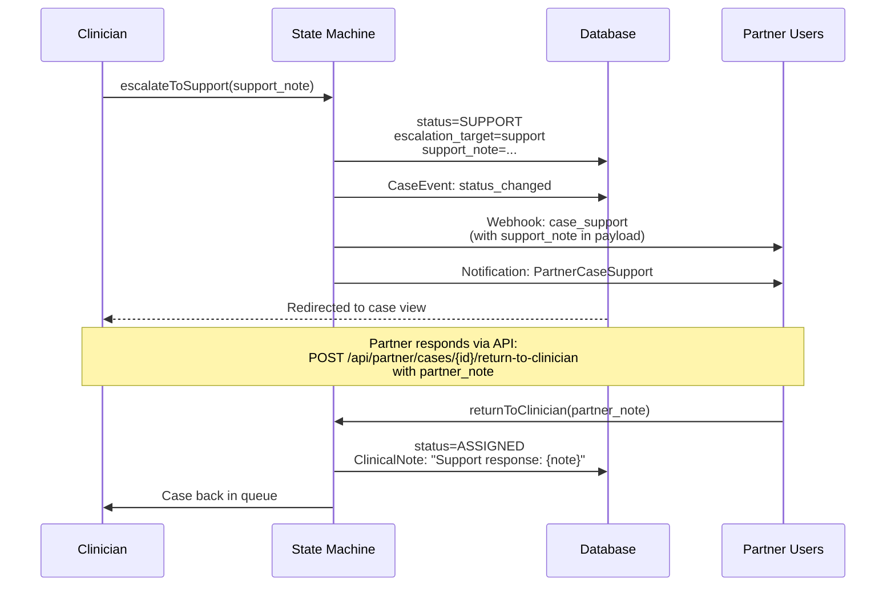
```mermaid
sequenceDiagram
    participant CL as Clinician
    participant SM as State Machine
    participant DB as Database
    participant PA as Partner Users

    CL->>SM: escalateToSupport(support_note)
    SM->>DB: status=SUPPORT<br/>escalation_target=support<br/>support_note=...
    SM->>DB: CaseEvent: status_changed
    SM->>PA: Webhook: case_support<br/>(with support_note in payload)
    SM->>PA: Notification: PartnerCaseSupport
    DB-->>CL: Redirected to case view

    Note over CL,PA: Partner responds via API:<br/>POST /api/partner/cases/{id}/return-to-clinician<br/>with partner_note
    PA->>SM: returnToClinician(partner_note)
    SM->>DB: status=ASSIGNED<br/>ClinicalNote: "Support response: {note}"
    SM->>CL: Case back in queue
```

### Escalate to Doctor Admin

Used when the clinician needs clinical guidance from their supervising physician.

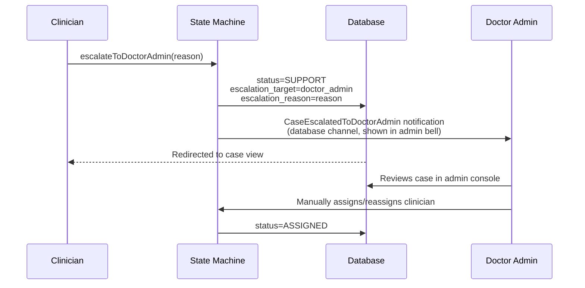
```mermaid
sequenceDiagram
    participant CL as Clinician
    participant SM as State Machine
    participant DB as Database
    participant DA as Doctor Admin

    CL->>SM: escalateToDoctorAdmin(reason)
    SM->>DB: status=SUPPORT<br/>escalation_target=doctor_admin<br/>escalation_reason=reason
    SM->>DA: CaseEscalatedToDoctorAdmin notification<br/>(database channel, shown in admin bell)
    DB-->>CL: Redirected to case view

    DA->>DB: Reviews case in admin console
    DA->>SM: Manually assigns/reassigns clinician
    SM->>DB: status=ASSIGNED
```

### Case Cancellation / Decline Flow (3-step for clinician)

When a clinician determines a patient cannot receive medication (contraindication, safety concern, incomplete information), the system requires a deliberate multi-step process to prevent accidental declines.

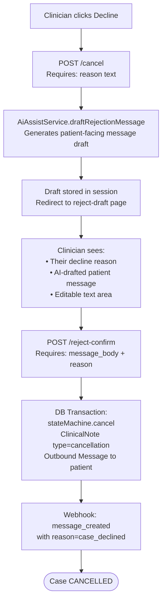
```mermaid
flowchart TD
    CL[Clinician clicks Decline] --> REASON[POST /cancel<br/>Requires: reason text]
    REASON --> AI_DRAFT[AiAssistService.draftRejectionMessage<br/>Generates patient-facing message draft]
    AI_DRAFT --> SESSION[Draft stored in session<br/>Redirect to reject-draft page]
    SESSION --> EDIT_PAGE[Clinician sees:<br/>• Their decline reason<br/>• AI-drafted patient message<br/>• Editable text area]
    EDIT_PAGE --> CONFIRM[POST /reject-confirm<br/>Requires: message_body + reason]
    CONFIRM --> TX[DB Transaction:<br/>stateMachine.cancel<br/>ClinicalNote type=cancellation<br/>Outbound Message to patient]
    TX --> WH[Webhook: message_created<br/>with reason=case_declined]
    WH --> DONE([Case CANCELLED])
```

**Why three steps?** A clinical decline has regulatory and patient-safety implications. The system forces the clinician to:
1. State their clinical reason (stored in `cancellation_reason`).
2. Review and edit the patient-facing message (which can be AI-assisted but must be confirmed).
3. Explicitly confirm the final send.

This audit trail satisfies telehealth documentation requirements.

---

## 11. Questionnaire / Intake Form Flow

Questionnaires are the primary clinical data collection mechanism. They are multi-step, dynamic, and support branching logic.

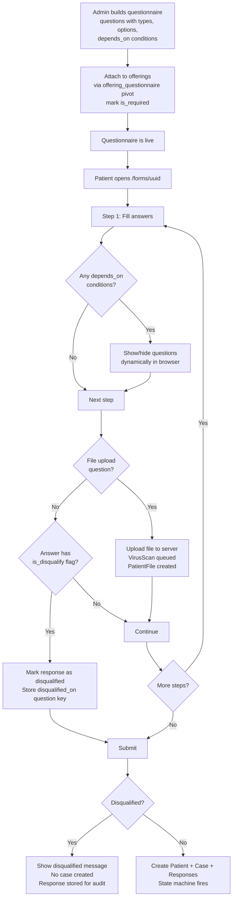
```mermaid
flowchart TD
    BUILD[Admin builds questionnaire<br/>questions with types, options,<br/>depends_on conditions]
    BUILD --> ATTACH[Attach to offerings<br/>via offering_questionnaire pivot<br/>mark is_required]
    ATTACH --> PUBLISH[Questionnaire is live]

    PUBLISH --> PATIENT[Patient opens /forms/uuid]
    PATIENT --> STEP1[Step 1: Fill answers]
    STEP1 --> BRANCH{Any depends_on<br/>conditions?}
    BRANCH -- Yes --> SHOW[Show/hide questions<br/>dynamically in browser]
    BRANCH -- No --> NEXT[Next step]
    SHOW --> NEXT
    NEXT --> FILE{File upload<br/>question?}
    FILE -- Yes --> UPLOAD[Upload file to server<br/>VirusScan queued<br/>PatientFile created]
    FILE -- No --> CHECK_DQ{Answer has<br/>is_disqualify flag?}
    CHECK_DQ -- Yes --> DQ[Mark response as disqualified<br/>Store disqualified_on question key]
    CHECK_DQ -- No --> CONTINUE[Continue]

    UPLOAD --> CONTINUE
    DQ --> SUBMIT
    CONTINUE --> MORESTEPS{More steps?}
    MORESTEPS -- Yes --> STEP1
    MORESTEPS -- No --> SUBMIT[Submit]

    SUBMIT --> RESULT{Disqualified?}
    RESULT -- Yes --> DISQ_PAGE[Show disqualified message<br/>No case created<br/>Response stored for audit]
    RESULT -- No --> CREATE_CASE[Create Patient + Case + Responses<br/>State machine fires]
```

### Question types supported

| Type | Description | Notes |
|------|-------------|-------|
| `text` / `email` / `textarea` | Free text | Standard inputs |
| `date` | Date picker | Used for date of birth |
| `number` / `height` / `weight` / `bmi` | Numeric | Auto-calculated for BMI |
| `choice` / `radio` | Single selection | Options can have `is_disqualify: true` |
| `multi` / `multiselect` / `checkbox` | Multiple selection | Each option can independently disqualify |
| `select` | Dropdown | Same option logic as choice |
| `file` | File upload | PDF/JPG/PNG, max 10MB, virus-scanned |
| `boolean` | Yes/No | |
| `hidden` | Pre-filled, not shown | For partner-passed data |

### Conditional question logic (`depends_on`)

A question can be shown only if another question meets a condition:

| Operator | Meaning | Example |
|----------|---------|---------|
| `gte` | Answer ≥ value | Show warning if BMI ≥ 40 |
| `lte` | Answer ≤ value | Only show if age ≤ 17 |
| `gt` / `lt` | Strictly greater/less than | |
| `contains` | Answer text contains string | Show follow-up if "yes" in multi-select |

### Linked questionnaires (standard_intake)

A questionnaire with `purpose=standard_intake` is a reusable sub-form embedded inside another. The parent questionnaire declares it via `linked_questionnaire_id`. When answers are submitted, the system automatically splits them across the parent and child questionnaire records.

---

## 12. Webhook System

Webhooks allow partner systems to receive real-time push notifications whenever a case changes state, so they don't need to poll the API.

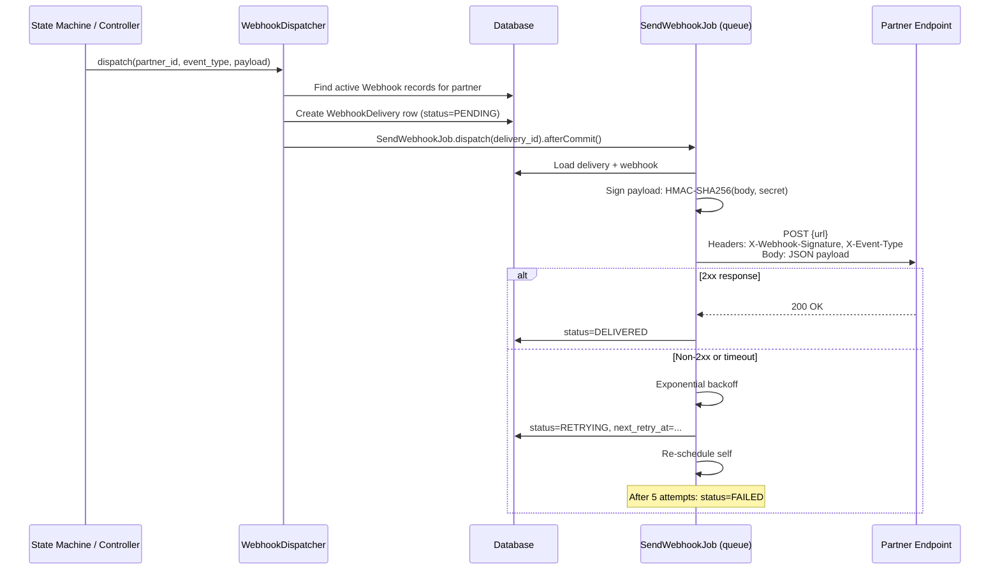
```mermaid
sequenceDiagram
    participant SM as State Machine / Controller
    participant WD as WebhookDispatcher
    participant DB as Database
    participant JOB as SendWebhookJob (queue)
    participant EP as Partner Endpoint

    SM->>WD: dispatch(partner_id, event_type, payload)
    WD->>DB: Find active Webhook records for partner
    WD->>DB: Create WebhookDelivery row (status=PENDING)
    WD->>JOB: SendWebhookJob.dispatch(delivery_id).afterCommit()

    JOB->>DB: Load delivery + webhook
    JOB->>JOB: Sign payload: HMAC-SHA256(body, secret)
    JOB->>EP: POST {url}<br/>Headers: X-Webhook-Signature, X-Event-Type<br/>Body: JSON payload

    alt 2xx response
        EP-->>JOB: 200 OK
        JOB->>DB: status=DELIVERED
    else Non-2xx or timeout
        JOB->>JOB: Exponential backoff
        JOB->>DB: status=RETRYING, next_retry_at=...
        JOB->>JOB: Re-schedule self
        Note over JOB: After 5 attempts: status=FAILED
    end
```

### Events that trigger webhooks

| Event | Triggered by |
|-------|-------------|
| `case_created` | Case state machine on creation |
| `case_waiting` | Status → WAITING |
| `case_assigned_to_clinician` | Status → ASSIGNED |
| `case_approved` | Status → APPROVED |
| `case_processing` | Status → PROCESSING |
| `case_completed` | Status → COMPLETED |
| `case_cancelled` | Status → CANCELLED |
| `case_support` | Status → SUPPORT (includes escalation_target, support_note) |
| `prescription_written` | After prescribe-confirm or batch-submit |
| `message_created` | Clinician sends a message; case decline; intake confirmation |
| `clinical_note_added` | Clinician adds a note |
| `patient_created` | New patient via API |
| `patient_modified` | Patient demographics updated |
| `patient_deleted` | Patient soft-deleted |

### Payload signing — how partners verify authenticity

```
HMAC-SHA256(rawBody, webhookSecret) → signature

Sent as header: X-Webhook-Signature: sha256={signature}

Partner verifies:
  computedSig = HMAC-SHA256(request.rawBody, storedSecret)
  if computedSig === header.value.replace("sha256=", "") → authentic
```

> **Critical:** Partners must verify using the **raw request body bytes**, not a parsed/re-serialized version. JSON serialization order can differ across languages, breaking the signature.

### Orphan recovery

The `webhooks:recover` artisan command runs every 5 minutes. It finds any `WebhookDelivery` rows that are `PENDING` for more than 10 minutes and haven't been picked up by the queue worker — this happens if the queue worker was down when the job was dispatched. Recovery re-dispatches them immediately.

---

## 13. SLA & Deadline Management

### SLA (Service Level Agreement)

SLA defines how quickly clinicians are expected to act on cases.

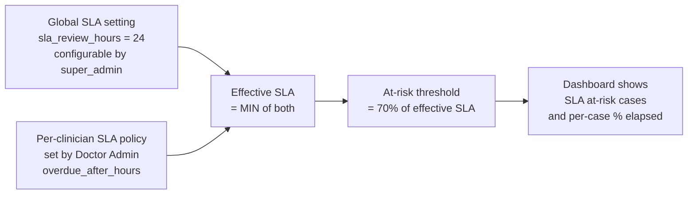
```mermaid
flowchart LR
    G[Global SLA setting<br/>sla_review_hours = 24<br/>configurable by super_admin] --> EFFECTIVE
    S[Per-clinician SLA policy<br/>set by Doctor Admin<br/>overdue_after_hours] --> EFFECTIVE
    EFFECTIVE[Effective SLA<br/>= MIN of both] --> RISK[At-risk threshold<br/>= 70% of effective SLA]
    RISK --> DASH[Dashboard shows<br/>SLA at-risk cases<br/>and per-case % elapsed]
```

**Example:** Global SLA = 24 hours. Doctor Admin sets a strict SLA of 12 hours for their clinician pool. Effective SLA = 12 hours. At-risk = 8.4 hours (70% of 12). If a case has been assigned for 9 hours without action, it appears highlighted on the dashboard as "at risk."

### Completion deadline (Pool model only)

When the pool model grants cases to a clinician, each case gets a `completion_deadline_at` timestamp — typically 24 hours from assignment. This is enforced by a scheduled sweep:

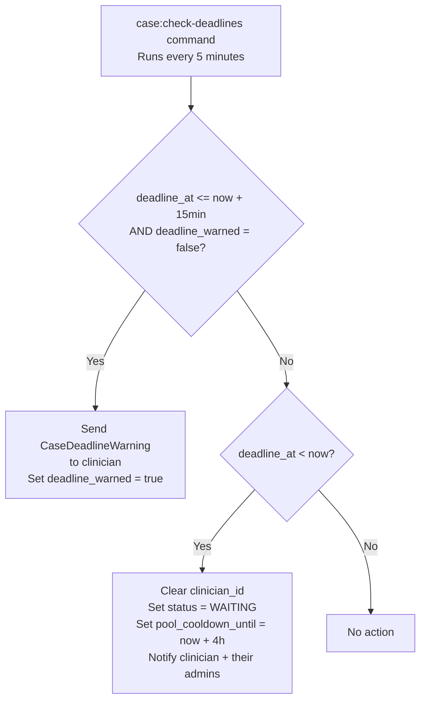
```mermaid
flowchart TD
    SWEEP[case:check-deadlines command<br/>Runs every 5 minutes] --> WARN{deadline_at <= now + 15min<br/>AND deadline_warned = false?}
    WARN -- Yes --> NOTIFY_CL[Send CaseDeadlineWarning<br/>to clinician<br/>Set deadline_warned = true]
    WARN -- No --> RELEASE{deadline_at < now?}
    RELEASE -- Yes --> AUTO_RELEASE[Clear clinician_id<br/>Set status = WAITING<br/>Set pool_cooldown_until = now + 4h<br/>Notify clinician + their admins]
    RELEASE -- No --> DONE[No action]
```

**Auto-release** puts the case back in the open queue. Another clinician (or a future pull from a different clinician) can then claim it. The original clinician is placed in cooldown — they cannot pull again from the pool for 4 hours.

### Scheduled commands summary

| Schedule | Command | Purpose |
|----------|---------|---------|
| Every 5 min | `webhooks:recover` | Re-dispatch stuck webhook deliveries |
| Every 5 min | `case:check-deadlines` | Warn + auto-release overdue pool cases |
| Every 15 min | `routing:sweep-exceptions` | Escalate and auto-close routing exceptions |
| On-demand | `cases:triage-backfill` | Re-classify all/unclassified cases |
| On-demand | `licensure:audit` | Verify all clinicians have licensed states on file |

---

## 14. AI Assist — Clinical Drafts

The AI assist system is a **drafting tool only**. It never sends, stores, or prescribes anything on its own. Every output goes through a human review step.

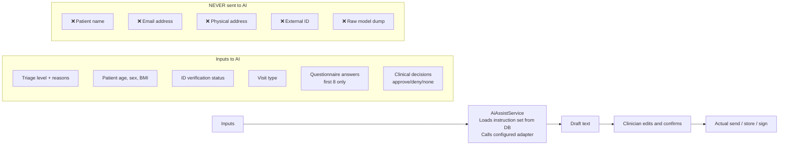
```mermaid
flowchart LR
    subgraph Inputs  to AI
        I1[Triage level + reasons]
        I2[Patient age, sex, BMI]
        I3[ID verification status]
        I4[Visit type]
        I5[Questionnaire answers<br/>first 8 only]
        I6[Clinical decisions<br/>approve/deny/none]
    end
    subgraph NEVER sent to AI
        N1[❌ Patient name]
        N2[❌ Email address]
        N3[❌ Physical address]
        N4[❌ External ID]
        N5[❌ Raw model dump]
    end
    Inputs --> AI[AiAssistService<br/>Loads instruction set from DB<br/>Calls configured adapter]
    AI --> DRAFT[Draft text]
    DRAFT --> HUMAN[Clinician edits and confirms]
    HUMAN --> ACTION[Actual send / store / sign]
```

### Four AI contexts

| Context | When used | What's generated | Fallback if AI fails |
|---------|-----------|-----------------|----------------------|
| `case_summary` | Clinician opens queue page | Brief bullet summary of top case | Static triage + demographics bullets |
| `clinical_note` | Clinician requests note assist | SOAP-style note draft | Deterministic composition from decisions |
| `rejection_reason` | Clinician declines case | Patient-facing decline message | Standard "cannot be approved at this time" |
| `patient_message` | After prescription confirmed | Approval message to patient | "Hi {name}, your prescription for {meds} has been reviewed..." |

**What happens if AI is unavailable or disabled?** Every call to `AiAssistService` is wrapped in a try-catch. On any failure (timeout, API error, disabled flag, no instruction set configured), it returns the deterministic fallback. The user sees the draft slightly differently styled (labeled "auto-generated" rather than "AI-generated"), but the workflow continues identically.

**No PHI to AI** is enforced at the code level — the service builds the input from a whitelist of fields, not from `$case->toArray()`. This is a hard architectural boundary, not a configuration option.

---

## 15. EHR Integration

After a clinician approves a case, clinical data can be pushed to an external EHR system (currently: Healthie).

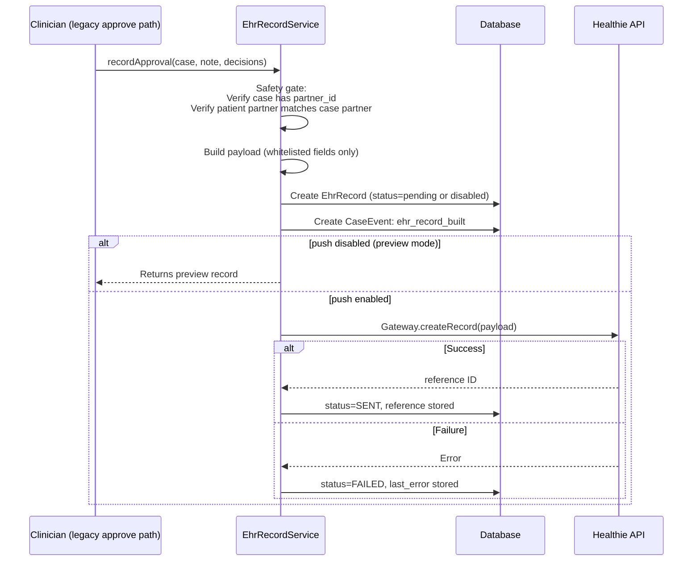
```mermaid
sequenceDiagram
    participant CL as Clinician (legacy approve path)
    participant EHR_SVC as EhrRecordService
    participant DB as Database
    participant HLT as Healthie API

    CL->>EHR_SVC: recordApproval(case, note, decisions)
    
    EHR_SVC->>EHR_SVC: Safety gate:<br/>Verify case has partner_id<br/>Verify patient partner matches case partner

    EHR_SVC->>EHR_SVC: Build payload (whitelisted fields only)
    EHR_SVC->>DB: Create EhrRecord (status=pending or disabled)
    EHR_SVC->>DB: Create CaseEvent: ehr_record_built

    alt push disabled (preview mode)
        EHR_SVC-->>CL: Returns preview record
    else push enabled
        EHR_SVC->>HLT: Gateway.createRecord(payload)
        alt Success
            HLT-->>EHR_SVC: reference ID
            EHR_SVC->>DB: status=SENT, reference stored
        else Failure
            HLT-->>EHR_SVC: Error
            EHR_SVC->>DB: status=FAILED, last_error stored
        end
    end
```

**Cross-tenant safety gate:** Before building the EHR payload, the service explicitly verifies that `patient.partner_id === case.partner_id`. If a patient record was somehow linked to the wrong partner, the EHR push is refused entirely. This prevents clinical data from one patient appearing in another partner's EHR account.

**An AI draft never reaches EHR.** The EHR service only processes a `ClinicalNote` that has already been written, reviewed, and persisted by a clinician. The pipeline is: Provider decision → Clinical note saved → EHR push. AI operates only in the drafting phase, before anything is saved.

---

## 16. Audit Trail

Every significant change to a clinical entity is automatically logged, immutably, in the `audit_logs` table.

### What gets audited

| Model | Actions logged |
|-------|---------------|
| `PatientCase` | created, updated (status changes, triage changes, clinician changes), deleted |
| `Clinician` | created, updated, deleted |
| `Partner` | created, updated, deleted |
| `User` | created, updated, deleted |
| `Offering` | created, updated, deleted |
| `OfferingCategory` | created, updated |
| `Setting` | updated |
| `StateVisitRequirement` | created, updated, deleted |
| `SlaPolicy` | created, updated, deleted |

### What's in each log entry

```json
{
  "actor_id": 5,
  "actor_name": "Dr. Smith",
  "action": "updated",
  "auditable_type": "PatientCase",
  "auditable_id": 1234,
  "auditable_label": "Case abc-uuid-123",
  "diff": {
    "status": {"old": "waiting", "new": "assigned"},
    "clinician_id": {"old": null, "new": 7}
  },
  "context": "/admin/cases/1234/assign",
  "created_at": "2026-08-07T14:23:01Z"
}
```

### What's intentionally excluded from audit diffs

**Security-sensitive fields** (stripped completely): `password`, `remember_token`, `client_secret`, `webhook_secret`

**Large opaque blobs** (excluded because they change wholesale and provide no useful diff): `metadata`, `clinical_intake`, `settings`, `faqs`, `images`, `levels`

### Immutability

The `AuditLog` model has no `update()` or `delete()` observer. The table has no soft-delete column. Audit records cannot be modified or removed through the application. This provides a tamper-evident record for compliance.

Audit log is viewable at `/admin/audit-log` (super_admin only).

---

## 17. Edge Cases & Safety Rules

This section documents specific decision points, failure modes, and their handling.

### Routing & Assignment Edge Cases

| Scenario | What happens |
|----------|-------------|
| No active routing policy | `NONE` outcome → `RoutingException` created → admin must manually assign |
| Case has no offering category | `NONE` outcome with `NO_CATEGORY_ON_CASE` → routing exception |
| Clinician has blank `licensed_states` | Blocked from all cases (fail-closed — blank ≠ licensed everywhere) |
| Two clinicians pull same case simultaneously | Only one atomic `UPDATE WHERE clinician_id IS NULL` succeeds; other is silently skipped |
| Refill case — prior clinician is over capacity | Continuity of care is attempted; if prior clinician over daily/open caps, the cap is **overridden** (soft override, not a hard block) for refill continuity |
| Refill case — prior clinician no longer licensed in state | Continuity of care fails; normal routing runs instead |
| Pool clinician misses 24h deadline | Case auto-released to WAITING, clinician gets 4h cooldown, admins notified |
| Partner changes product plan after case created | Has no effect — case_offerings snapshot the plan at creation time |

### Prescribing Edge Cases

| Scenario | What happens |
|----------|-------------|
| Clinician reloads prescribe page with existing draft | Redirected to review page (no duplicate draft created) |
| Clinician discards draft | Draft deleted from DB, returned to prescribe form — case status unchanged |
| prescribe-confirm called twice (network retry) | Second call finds existing `PrescriptionDocument` and existing `PharmacyDispatch` — both idempotent, no duplicates |
| Patient has no email | Prescription approval mail skipped (no error) |
| Patient email_opt_in = false | Mail skipped silently |
| Reverb WebSocket broadcast fails | Non-fatal — caught and logged; patient just doesn't get real-time update (sees on next poll) |
| Clinician not licensed in patient state | 403 Forbidden on every action — they cannot view, approve, message, or upload files for that case |

### Patient Intake Edge Cases

| Scenario | What happens |
|----------|-------------|
| Patient submits same external_id twice (API) | First call creates patient, second call returns existing patient with 200 (not 201, not error) |
| Case submitted with duplicate external_id | 409 Conflict — partner must use a unique external_id per case |
| Patient found by email but different external_id | Matched by email; demographics updated; case created for existing patient |
| Patient email matches across different partners | No match — partner scoping means a patient with the same email on Partner A and Partner B are treated as separate patients |
| Offering not available in patient's state | 422 validation error (API) or state-hold created (public form) |
| Questionnaire answer triggers disqualification | Response stored, no case created (API: 422; form: disqualified message shown) |
| Required questionnaire missing from case (API) | 422 error with field-level detail |

### Questionnaire Edge Cases

| Scenario | What happens |
|----------|-------------|
| Question deleted after responses recorded | `questionnaire_question_id` SET NULL in `questionnaire_answers`; `question_text` column preserves the original text |
| Linked (standard_intake) questionnaire submitted directly | Blocked — cannot be attached to offerings, cannot be submitted standalone |
| File upload fails virus scan | `PatientFile.status` set to `failed`; file deleted from disk; no error shown to patient (silent) |
| File uploaded but case creation fails | File remains in DB with `case_id=null`; orphaned file is NOT automatically cleaned up (manual cleanup or background sweep needed) |

### Webhook Edge Cases

| Scenario | What happens |
|----------|-------------|
| Partner endpoint returns non-2xx | Exponential backoff retry up to 5 times |
| Partner endpoint returns HTML instead of 200 | Logged as a warning (misconfigured endpoint); treated as non-2xx |
| Queue worker was down when job dispatched | `webhooks:recover` (every 5 min) re-dispatches pending deliveries stuck for >10 min |
| Webhook secret changes after deliveries are in flight | In-flight deliveries use the secret at creation time (not re-fetched at delivery) — a secret rotation requires resending affected deliveries |
| Partner has no active webhooks for this event | `WebhookDispatcher::dispatch` queries and finds 0 rows — no delivery rows created, no jobs dispatched |

### SLA & Scheduling Edge Cases

| Scenario | What happens |
|----------|-------------|
| Global SLA = 24h, Doctor Admin SLA = 12h | Effective SLA = 12h (MIN wins). At-risk = 8.4h |
| Doctor Admin has no SLA policy | Only global SLA applies |
| Doctor Admin's SLA policy `is_active = false` | Treated as not existing (only global applies) |
| `deadline_warned` already true | Warning not re-sent on next sweep (prevents notification spam) |
| Auto-release fires, but clinician has no admins | Notification falls back to all `admin`/`super_admin` users |

### Triage Edge Cases

| Scenario | What happens |
|----------|-------------|
| Patient ID verification status = null | Bumped to YELLOW (treated as unverified, not passed) |
| Case is on hold when triaged | Minimum YELLOW enforced |
| Multiple disqualifying answers | Each generates its own reason code; all stored in `triage_reasons` array |
| Patient IDV status updated after case assigned | Triage re-runs on all open cases for that patient; clinician sees updated triage color |
| `triage_rules` table | Currently empty and unused — do not read or write to it for triage logic |

---

## 18. Security & Compliance Guardrails

These are non-negotiable safeguards built into the system architecture.

### State licensing enforcement (LAW 4)

Every clinician-facing action on a case is gated by a license check:

```
assertLicensedForCase($case):
  → Load clinician.licensed_states
  → Check if patient_state (or patient.state) is in licensed_states
  → If not: throw 403 AuthorizationException
```

This check runs on: case show, case assign, prescribe form, prescribe create, prescribe confirm, prescribe discard, batch preflight, batch submit, approve, cancel, reject-confirm, add note, send message, upload file, download file, preview file, delete file.

Admins acting through admin-specific routes bypass this check (they are not prescribing clinicians).

### Data isolation (multi-tenant scoping)

```
PatientCase::visibleTo($user):
  - super_admin    → no WHERE clause (sees all)
  - admin          → WHERE clinician_id IN (their doctors) OR clinician_id IS NULL
  - admin with no doctors → WHERE clinician_id IN ([]) → matches nothing
```

A Doctor Admin with no assigned clinicians sees zero cases. This is intentional — access is granted by explicit doctor assignment, not by admin role alone.

### PHI in AI — hard whitelist

The `AiAssistService` builds AI inputs from an explicit whitelist:
- Age, sex, BMI, triage, IDV status, visit type, clinical decisions, questionnaire answer text
- Never: patient name, email, phone, address, external_id, date_of_birth, or any full model dump

### PHI in SMS — fixed generic text

When a clinician sends a portal message and the patient has `sms_opt_in=true`, an SMS is sent to the patient's phone. The SMS body is a **fixed, generic string** with no PHI ("You have a new message in your patient portal. Log in to view it."). The actual message content stays in the portal only.

Additionally, an SMS debounce prevents spam: only one SMS is sent per case per 30 minutes (configurable via `sms.debounce_minutes`).

### Prescription document immutability

The `PrescriptionDocument` model throws `RuntimeException` on `update()` or `delete()`. This is enforced at the model layer, not just the controller. Even if a developer calls `$document->update([...])` in a migration or tinker session, it will fail.

### File virus scanning

Every uploaded file (intake forms, admin uploads, clinician uploads) triggers `ScanUploadedFileJob`. An infected file is:
1. Deleted from disk immediately.
2. `PatientFile.status` set to `failed`.
3. The patient/clinician sees no error — the upload appears to have worked, but the file is inaccessible. (Note: consider surfacing this error in a future iteration.)

### Audit log masking

The `AuditObserver` strips these fields from all audit diffs before storage: `password`, `remember_token`, `client_secret`, `webhook_secret`. These fields are silently removed — they will never appear in `diff`, even if they changed.

### Cross-tenant EHR safety gate

`EhrRecordService` explicitly verifies `patient.partner_id === case.partner_id` before building the EHR payload. If there's a data inconsistency, the EHR push is refused, preventing one partner's clinical data from appearing in another partner's EHR account.

---

## Appendix: Quick Reference — Who Does What

```mermaid
flowchart TD
    subgraph PARTNER
        PA1[Create patient via API]
        PA2[Submit case via API]
        PA3[Update clinical intake]
        PA4[Set case on hold]
        PA5[Cancel case]
        PA6[Respond to support escalation]
    end

    subgraph SUPERADMIN
        SA1[Create partner, clinician, offering]
        SA2[Configure routing policy]
        SA3[Configure SLA settings]
        SA4[Configure AI instruction sets]
        SA5[Manage questionnaires]
        SA6[View audit log]
        SA7[Resend webhook deliveries]
    end

    subgraph DOCTORADMIN
        DA1[View cases for their clinicians]
        DA2[Manually assign/reassign cases]
        DA3[Approve / deny pool pull requests]
        DA4[Set SLA policies for their pool]
        DA5[Manage clinician priority order]
        DA6[View exception center]
    end

    subgraph CLINICIAN
        CL1[Pull cases from pool]
        CL2[Self-assign from waiting queue]
        CL3[Review case + intake answers]
        CL4[Write draft prescription]
        CL5[Review and confirm prescription]
        CL6[Add clinical notes]
        CL7[Send patient messages]
        CL8[Escalate to support / admin]
        CL9[Decline case with patient message]
        CL10[Batch approve GREEN cases]
    end

    PA2 --> CASE[(Case in MEDAXIS)]
    CASE --> DA2
    CASE --> CL1
    CL5 --> RX[(Prescription signed)]
    RX --> PHARM[(Pharmacy dispatched)]
```

---

*End of process flow documentation. For database schema details, see [database-structure.md](database-structure.md). For API integration, see the Partner API Guide in the developer guides section of the admin console (`/admin/guides`).*
